# MathFlow AI

> **開發狀態說明**
>
> MathFlow AI 目前仍在持續開發中，整體功能框架已經形成，但多處功能、細節體驗與穩定性仍在完善階段。當前版本更適合被理解為一個正在快速推進中的教學支援平台原型，而不是已經完全定型的成熟產品。

MathFlow AI 是一套圍繞數學教學真實工作流程設計的智能工作台，面向備課、出題、解題講解、學生作答分析、整卷試卷處理與 DSE 數學出卷等場景。

它的重點，不只是讓模型回答一道題，而是把老師日常反覆要做、又很花時間的工作，整理成可以持續推進、持續修改、可追蹤進度的完整流程。對於學校而言，它更適合被理解為一套仍在持續完善中的教學支援平台原型。

---

## 項目定位

在學校日常教學中，數學老師往往需要同時處理多個環節：備課、解題講解、作答分析、試卷講評、出題調整與 DSE 題目設計。這些工作既有專業要求，也有較強的重複性與時間壓力。

MathFlow AI 的定位，不是一個普通的 AI 對話頁面，而是一套圍繞真實教學流程組織起來的工作平台。它把原本零散的一次性提問，整理成多個可持續推進的頁面與流程，使老師可以在同一個系統中完成不同類型的教學任務。

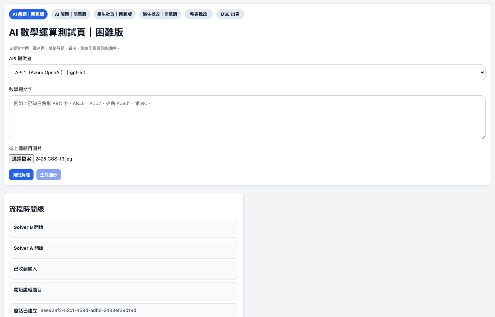

*圖 1：系統首頁提供多個數學教學場景入口，包括解題、批改、整卷處理與 DSE 出卷。*

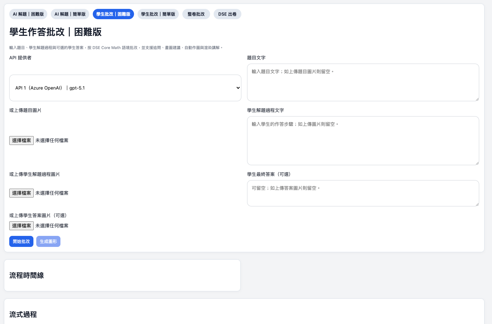

*圖 2：平台圍繞不同教學任務提供對應頁面，而不是把所有需求都放進單一對話框。*

---

## 與一般 AI 對話工具的區別

一般的 AI 對話工具，更適合處理單次提問，例如臨時問一道題、臨時要一份答案，或快速生成一段說明。但在教學場景中，很多工作並不是「一問一答」就能完成。

MathFlow AI 的區別主要體現在以下幾個方面：

1. **不是只返回一次結果，而是按流程持續推進**
   系統會先建立任務，再持續回傳處理狀態、階段結果與最終輸出，老師可以知道任務進行到哪裡，而不是只等最後一條回覆。

2. **不是只有單次回答，而是支援多階段協同處理**
   對於較複雜的數學任務，系統會把工作拆成多個階段，分別處理分析、判斷、講解、圖形生成或整卷整理等內容。

3. **不是只適合零散提問，而是適合完整教學工作**
   從單題解答、學生批改，到整卷 PDF 處理與 DSE 出卷，平台更強調連續工作流程，而不是臨時對話。

4. **不是一次生成後結束，而是支援繼續修改與追問**
   尤其在 DSE 出卷場景中，老師可以繼續補條件、要求重新驗算、繼續修改草稿或導出結果。

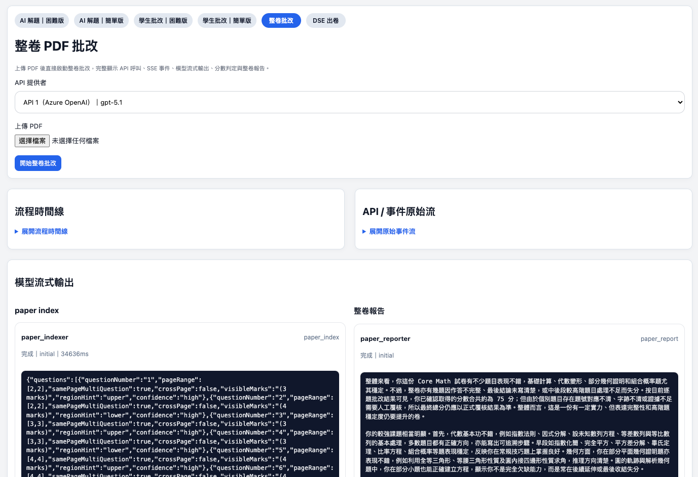

*圖 3：系統會持續回傳處理進度與階段結果，便於老師掌握當前狀態。*

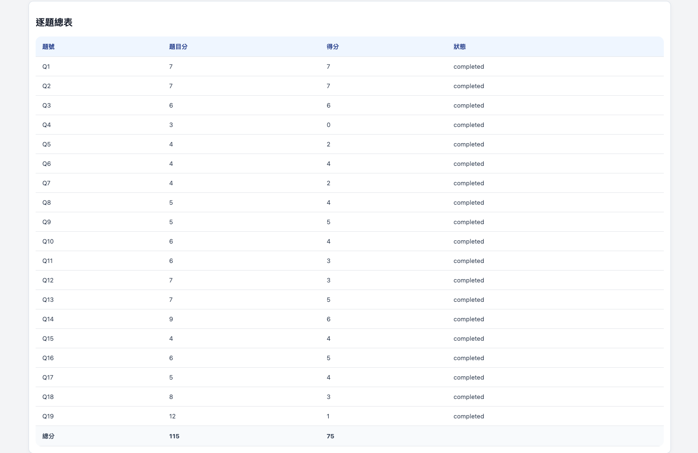

*圖 4：同一項教學任務可以拆分為多個處理步驟，更貼近真實工作流程。*

---

## 頁面與功能總覽

目前平台主要對應六個頁面，分別服務不同教學場景：

1. AI 解題（困難版）
2. AI 解題（簡單版）
3. 學生作答批改（困難版）
4. 學生作答批改（簡單版）
5. 整卷 PDF 處理與批改
6. DSE 出卷工作台

這樣的頁面設計，代表系統不是把所有需求都塞進同一個聊天框，而是依照老師實際工作內容，拆成清楚的使用入口與處理流程。

---

## 各頁面功能說明

### 1. AI 解題頁面（困難版）

這一頁面用於處理較複雜的單題解答任務，支援輸入文字題或圖片題。頁面會展示完整的處理過程，包括：

- 題目輸入
- 題目標準化
- Solver A 的分析過程
- Solver B 的分析過程
- Judge 的綜合判斷
- 最終答案
- 圖形建議與圖形生成
- 最終講解內容
- 時間線與階段狀態

這一頁適合用於：

- 備課時驗證較複雜題目
- 課前整理講解結構
- 為示範答案與講評做準備
- 對高難度題目進行較穩妥的交叉分析

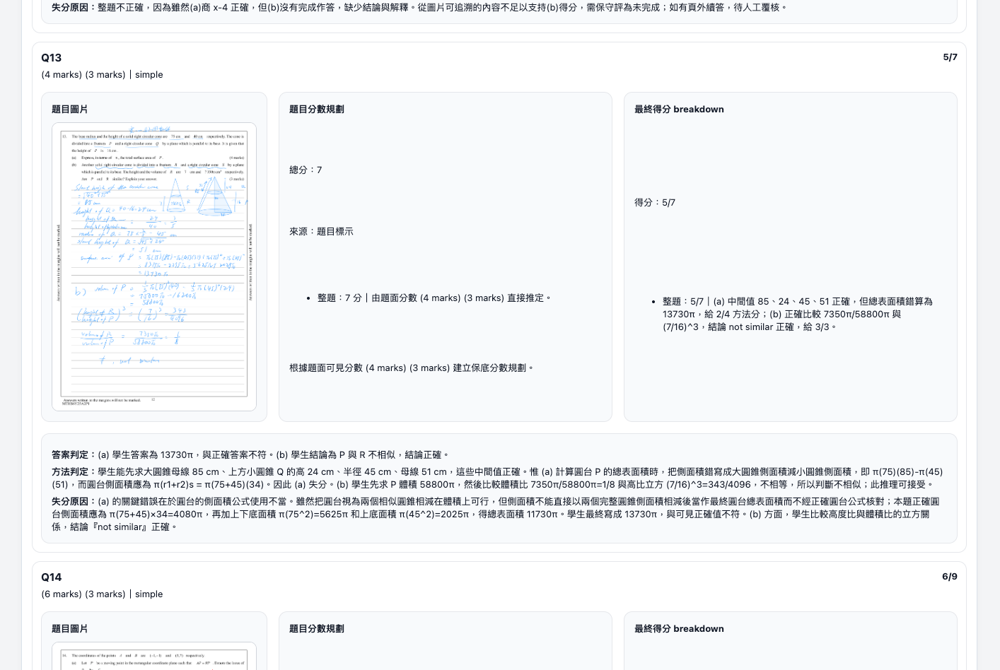

*圖 5：困難版解題頁面會展示雙路分析、綜合判斷、圖形與講解內容。*

### 2. AI 解題頁面（簡單版）

簡單版同樣支援文字題與圖片題，但流程比困難版更精簡。它主要圍繞 Judge 的輸出來呈現結果，同時保留：

- 題目輸入
- 題目標準化
- Judge 分析與答案
- 圖形建議與圖形生成
- 最終講解
- 時間線與狀態提示

這一頁更適合：

- 日常快速驗題
- 課堂前短時間整理題目
- 對不需要雙路分析的題目做較快處理

### 3. 學生作答批改頁面（困難版）

這一頁面用於圍繞學生作答過程開展批改輔助。老師可以輸入題目、學生過程與學生答案，系統會逐步輸出：

- 題目標準化
- 分析 A
- 分析 B
- Review Judge 的綜合判斷
- 分數規劃
- 最終得分拆分
- 參考答案與評分說明
- 圖形建議與圖形生成
- 批改後講解
- followup 追問記錄

它的重點不是只判斷對錯，而是協助老師形成更完整的講評與回饋材料。

適合用於：

- 課後講評準備
- 小測與作業講解
- 分析學生錯因與失分點
- 形成更具體的後續指導意見

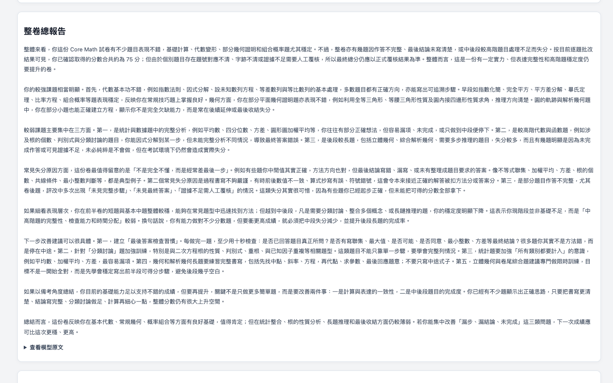

*圖 6：批改頁面可圍繞題目、作答過程、評分與講解形成完整回饋。*

### 4. 學生作答批改頁面（簡單版）

簡單版批改頁面保留批改主流程，但比困難版更集中於核心結果，主要包括：

- 題目與學生作答輸入
- 批改結果
- 分數規劃
- 分數拆分
- 圖形建議
- 最終講解
- followup 追問

這一頁較適合：

- 日常快速批改整理
- 需要較快形成回饋框架的場景
- 不需要展示雙分析細節的教學工作

### 5. 整卷試卷處理頁面

這一頁面用於處理整份 PDF 試卷。系統支援上傳 PDF 後開展整卷分析，並在頁面中逐步展示：

- 整卷時間線
- 原始事件流
- 試卷索引結果
- 題組與題目整理
- 逐題處理狀態
- 各題模型調用記錄
- 逐題分數卡
- 分數總表
- 整卷報告
- 錯誤與重試情況

這一頁更適合：

- 測驗、練習卷、模擬考後的整卷整理
- 考後講評材料準備
- 從整體與逐題兩個層次觀察試卷表現

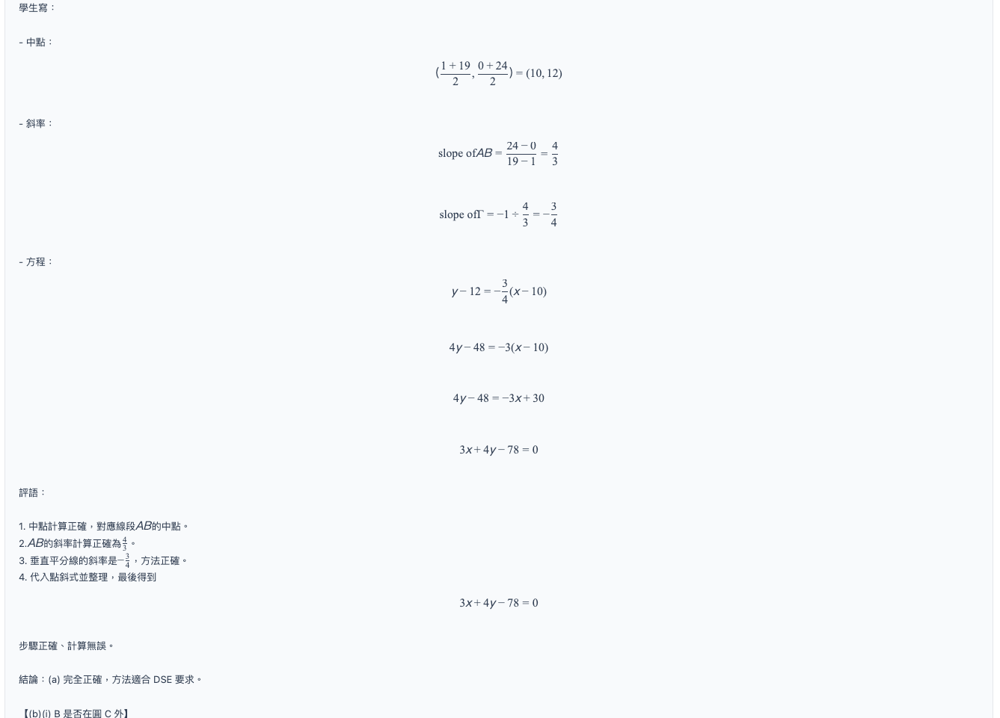

*圖 7：整卷處理頁面可直接圍繞一整份 PDF 試卷開展整理、逐題處理與匯總。*

### 6. DSE 出卷工作台

這一頁面是項目中的重點能力之一。它不是單次生成題目，而是一個可持續互動的工作台。頁面主要包括：

- 老師需求輸入區
- Agent transcript 對話區
- 題目草稿區
- 設定面板
- 活動面板
- 模型調用記錄
- 工具調用記錄
- followup 輸入區
- 導出按鈕
- 重新驗算能力

老師可以先給出卷方向，再持續追加要求，要求系統修改題目、補條件、重新驗算，直到草稿更接近實際需要。

它更適合：

- DSE 題目初稿生成
- 多輪修改與調整
- 根據題型、卷別、難度、語言與課題要求生成草稿
- 對題目與答案做持續驗算與再加工

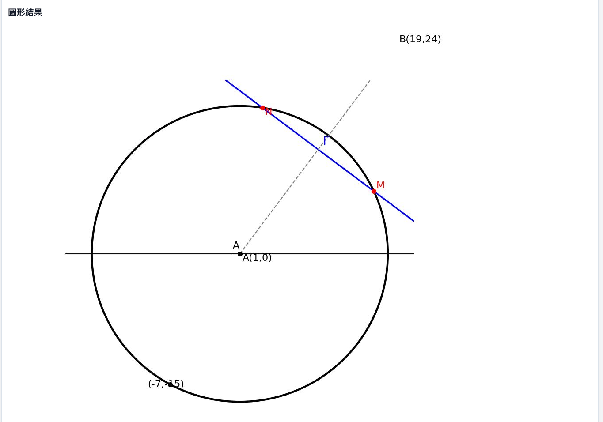

*圖 8：DSE 出卷頁面採用工作台形式，支援持續調整、多輪推進與草稿管理。*

---

## 困難版解題的處理方式

困難版解題不是只讓模型回答一次，而是採用更穩妥的多路處理方式：

- **Solver A** 負責一條解題路徑
- **Solver B** 同時負責另一條相對獨立的解題路徑
- **Judge** 再根據兩邊結果作綜合判斷

這種處理方式的意義，在於盡量降低單一路徑偶然出錯時帶來的影響。對於步驟較長、表達較複雜、需要較高嚴謹性的數學題，這種雙路分析再綜合判斷的方式，會比單次回答更可靠。

頁面中可以直接看到：

- Solver A 的流式分析內容
- Solver B 的流式分析內容
- Judge 的綜合判斷過程
- 最終答案與講解結果

因此，這一頁不只是給出答案，而是提供一個更可觀察、也更穩妥的解題流程。

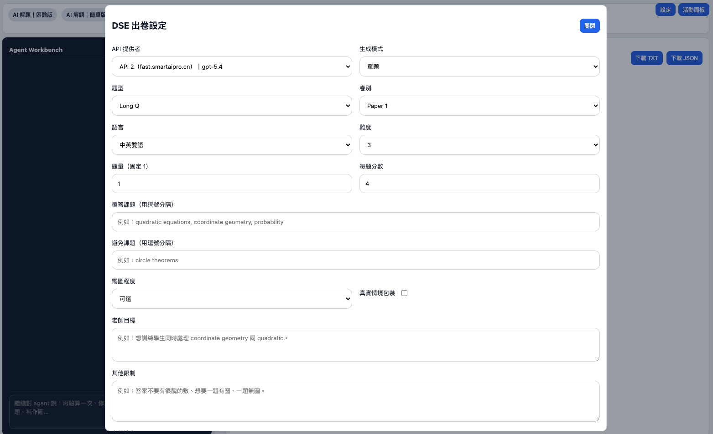

*圖 9：困難版解題會同時展開兩條分析路徑，再由 Judge 作綜合判斷。*

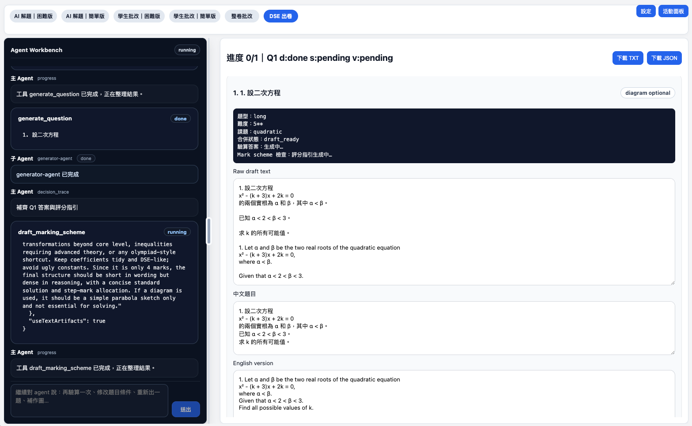

*圖 10：系統會在多路結果基礎上形成最終答案與講解。*

---

## 模型如何協同處理任務

在 MathFlow AI 中，模型並不是只負責輸出一句結果，而是按照不同頁面的任務需要，參與多個處理階段。

### 解題頁面中的模型分工

在解題流程中，模型可分別承擔：

- 題目理解與標準化
- Solver A 解題分析
- Solver B 解題分析
- Judge 綜合判斷
- 最終講解生成
- 圖形建議判斷
- 圖形生成規劃

### 批改頁面中的模型分工

在批改流程中，模型可分別承擔：

- 題目與作答理解
- 分析 A
- 分析 B
- Review Judge 判斷
- 分數規劃
- 分數拆分
- 參考答案生成
- 批改後講解
- followup 回應

### 整卷頁面中的模型分工

在整卷處理流程中，模型可分別承擔：

- 試卷索引與結構整理
- 題組與題目辨識
- 逐題參考答案或評語生成
- 逐題批改與分數處理
- 整卷報告生成

### DSE 工作台中的模型分工

在 DSE 工作台中，模型可分別承擔：

- 老師需求理解
- 出卷意圖整理
- 藍圖生成
- 題目草稿生成
- 答案草稿生成
- 驗算與再檢查
- followup 回應
- 整卷或導出內容整理

因此，系統中的模型調用更像是一組圍繞任務分工的協同過程，而不是單一模型一次性回答全部問題。

---

## 系統可調用的工具能力

除了文本生成以外，MathFlow AI 還具備若干可被流程調用的工具能力，用於支援更完整的教學任務。

### 1. AI 作圖能力

系統支援根據題目內容生成圖形。其處理方式不是簡單輸出一句「建議畫圖」，而是：

- 先判斷題目是否需要圖形
- 再生成對應的作圖程式碼
- 然後調用 Python 與 matplotlib 執行
- 最終把圖像返回到頁面中

這意味著平台具備真正的 **AI 作圖能力**，尤其適用於：

- 幾何題
- 需要圖像輔助說明的應用題
- 函數與座標圖像題
- DSE 出題中的配圖需求

這也是平台與一般只會「文字說明」的聊天工具之間的重要差別之一。

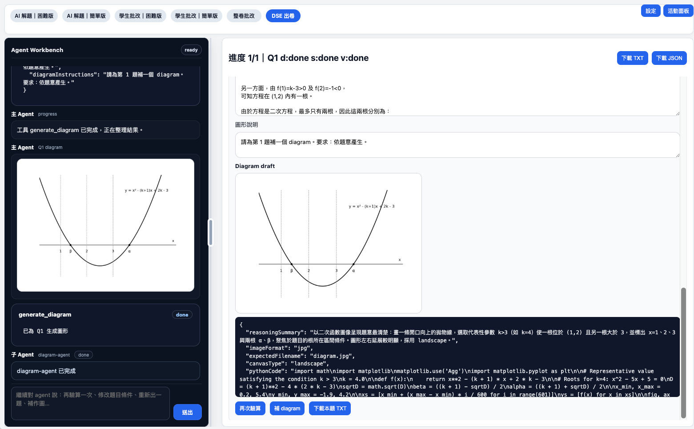

*圖 11：系統不僅能處理文本結果，也能在相關流程中結合圖形與逐題狀態進行展示。*

### 2. PDF 處理能力

在整卷試卷處理場景中，系統可以調用 PDF 相關能力，對整份試卷進行：

- 頁面渲染
- 頁面圖片轉換
- 題目區域整理
- 後續逐題處理

這也是整卷頁面能夠圍繞 PDF 開展逐題處理與整體報告整理的基礎。

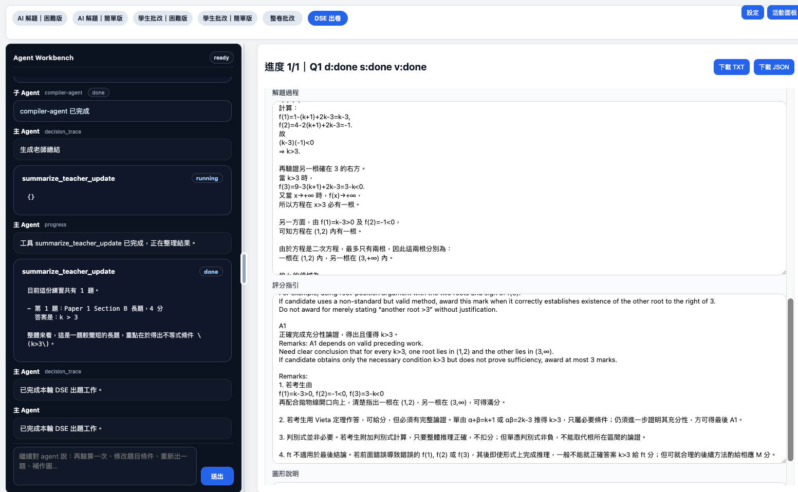

*圖 12：整卷頁面能夠把逐題結果進一步整理成總表與整體觀察。*

### 3. DSE 工作台中的工具調用

在 DSE 出卷工作台中，系統不僅會生成文字草稿，還會按需要調用內部工具完成後續工作，例如：

- 題目草稿整理
- 答案與過程草稿補全
- 驗算與重新檢查
- 圖形生成
- 導出文本結果
- 導出 JSON 結果

因此，DSE 頁面並不是單純的聊天介面，而是一個可以持續調用不同能力完成工作的 AI 工作台。

*圖 13：DSE 工作台支援對話區與草稿區並行使用，方便老師邊看邊改。*

*圖 14：活動面板可以用於查看過程、模型調用與工具調用記錄。*

---

## 為什麼這個項目更適合做教學工作台

綜合來看，MathFlow AI 的價值不只是把 AI 接進教學場景，而是把 AI 的能力整理成更接近老師真實工作的使用方式：

- 有不同頁面對應不同任務
- 有清楚的階段與進度回傳
- 有多模型或多角色協同處理
- 有圖形生成與 PDF 處理能力
- 有 DSE 工作台式的持續互動與工具調用能力

這使它更接近一套可以逐步完善、逐步擴展的教學支援平台，而不是單純的 AI 對話入口。

---

## 對學校與老師的實際意義

### 對老師

- 減少重複性整理工作
- 更快形成講解、批改與回饋材料
- 更方便處理複雜題與整卷任務
- 在 DSE 出題場景中更方便持續修改與再加工

### 對學校管理層

- 更適合作為學科型 AI 應用示範
- 更貼近學校真實教學場景，而不是停留在概念層面
- 可作為備課支援、講評支援、出題支援與回饋效率優化的平台基礎
- 對 DSE 數學場景具有較明確的針對性與延展空間

---

## 適合的應用場景

- 數學老師日常備課
- 單題講解與複雜題驗證
- 學生作答分析與講評
- 測驗、練習卷與模擬考後的整卷整理
- DSE 數學出題、調整與再加工
- 校內教學創新與 AI 支援平台試點

---

## 延伸閱讀

如果需要進一步了解項目，可繼續閱讀：

- [項目簡介](doc/项目简介.md)
- [項目文檔](项目文档.md)
- [開發者 API 與原始碼詳解](doc/开发者API与源码详解.md)
- [部署依賴與環境要求](doc/部署依赖与环境要求.md)

---

## 使用聲明

本倉庫以公開展示為目的，用於作品集、項目介紹與能力展示。

除非事先取得本人書面同意，未經書面授權，禁止任何形式的商業使用、修改或二次分發。
保留一切權利。

---

**Prepared by Chito**
**Date:** 2026-04-06
